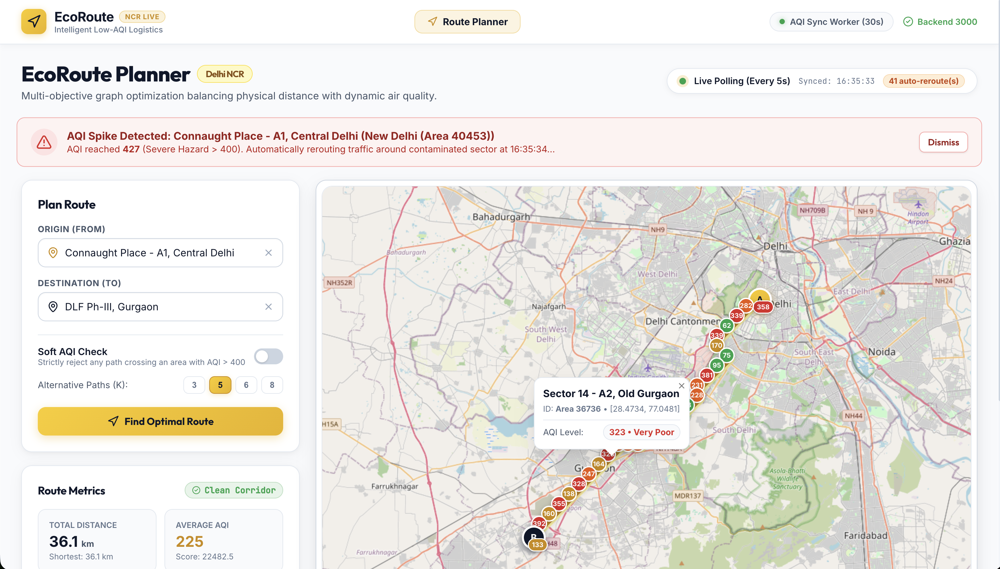
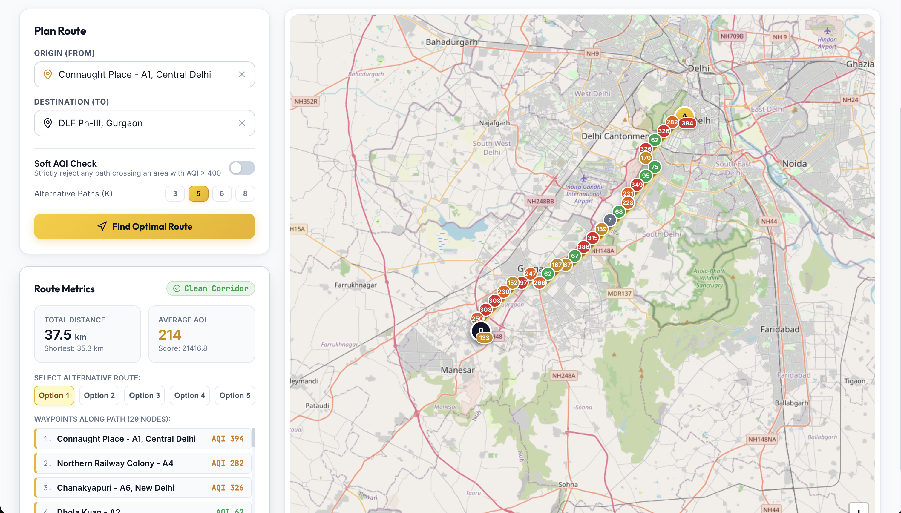

# EcoRoute Finder

## Project Description

EcoRoute Finder is a logistics dashboard that identifies delivery routes using road distance and neighborhood air quality data.

## What It Does

The application returns the top K shortest viable routes while prioritizing paths with an AQI below 400. It helps delivery operators avoid areas with hazardous air quality.

## How It Works

The system models neighborhoods as graph nodes and roads as distance-weighted connections. It evaluates route distance and AQI, then polls every five seconds for changes. If a node on the selected route reaches an AQI of 400 or higher, the system recalculates the route.

If every available route exceeds the AQI threshold, the system reports that no optimal safe route is available.

## Data Model

Seed data is stored in the `api/seeding` folder as JSON arrays. Each area is represented as a graph node, and each road is represented as a relationship between nodes with distance as its weight.

## Previews

The React dashboard provides location selection, route recommendations, AQI status, and map-based route visualization.





## How to Run

Install dependencies and start the API:

```bash
cd api
npm install
npm run migrate
npm run seed
npm start
```

In a second terminal, start the web application:

```bash
cd web
npm install
npm run dev
```

## Manual Testing

1. Open the web application in a browser.
2. Select `Connaught` as the origin and `DLF Phase` as the destination.
3. Click **Find Optimal Path**.
4. Confirm that the system displays the top K eligible routes.
5. Verify that the system polls for AQI changes every five seconds and reroutes when a considered node reaches AQI 400 or higher.

## Automated Tests

```bash
cd api
npm test
```
